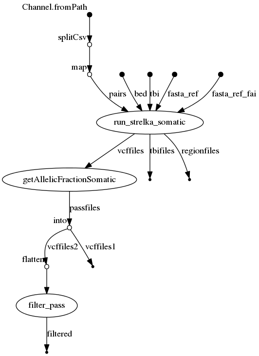

# strelka2-nf
### Strelka v2 pipeline with Nextflow

#### Dependencies
1. Nextflow : for common installation procedures see the [IARC-nf](https://github.com/IARCbioinfo/IARC-nf) repository.
2. Install [Strelka v2](https://github.com/Illumina/strelka).

## Input 
 | Type      | Description     |
  |-----------|---------------|
  | --input_folder    | folder with bam files |
  |--input_file | Tab delimited text file with either two columns called normal and tumor (somatic mode) or one column called bam (germline mode); optionally, a column called sample containing sample names to be used for naming the files can be provided and for genotyping (see genotyping mode below) a column called vcf has to be provided |

Note: the file provided to --input_file is where you can define pairs of bam to analyse with strelka in somatic mode. It's a tabular file with 2 columns normal and tumor.

| normal | tumor |
| ----------- | ---------- |
| normal1.bam | tumor2.bam |
| normal2.bam | tumor2.bam |
| normal3.bam | tumor3.bam |

## Parameters

* #### Mandatory

| Name | Example value | Description |
|-----------|--------------|-------------| 
|--ref    | hg19.fasta | genome reference |

* #### Optional

| Name | Default value | Description |
|-----------|--------------|-------------| 
| --mode | somatic | Mode for variant calling; one of somatic, germline, genotyping |
|--output_folder   | strelka_ouptut | Output folder for vcf files |
|--cpu          | 2 | number of CPUs |
|--mem         | 20 | memory|
|--strelka  | path inside docker and singularity containers | Strelka installation dir |
|--config | default conf of strelka | Use custom configuration file |
|--callRegions | none | Region bed file |

* #### Flags

Flags are special parameters without value.

| Name  | Description |
|-----------|-------------| 
| --help | print usage and optional parameters |
| --exome | automatically set up parameters for exome data |
| --rna | automatically set up parameters for rna data (only available for --mode germline) |
| --AF | Add AF field to VCF (only available for --mode somatic) |
|--outputCallableRegions | Create a BED track containing regions which are determined to be callable |

## Usage

### mode somatic
`nextflow run iarcbioinfo/strelka2.nf r v1.1 -profile singularity --mode somatic --ref hg38.fa --tn_pairs pairs.txt --input_folder path/to/bam/ --strelka path/to/strelka/`

To run the pipeline without singularity just remove "-profile singularity". Alternatively, one can run the pipeline using a docker container (-profile docker) the conda receipe containing all required dependencies (-profile conda).

### mode germline
`nextflow run iarcbioinfo/strelka2.nf r v1.1 -profile singularity --mode germline --ref hg38.fa --input_folder path/to/bam/ --strelka path/to/strelka/`

### genotyping
When using the input_file mode, if a vcf column with the path to a VCF file for each sample containing a list of somatic variant is provided, the pipeline will use the --forcedGT option from strelka that genotypes these positions, and compute a bedfile for these positions so only variants from the VCF will be genotyped. Note that genotyping can be performed both in somatic mode (in which case tumor/normal pairs must be provided) and germline mode (in which case a single bam file must be provided).

## Output
  | Type      | Description     |
  |-----------|---------------|
  | VCFs/raw/\*.vcf.gz    | VCF files before filtering |
  | VCFs/withAF/\*.vcf   | VCF files with AF field (optional, requires flag --AF) |
  | VCFs/filtered/\*PASS.vcf.gz    | final compressed and indexed VCF files (optionally with flag --AF) |
  | CallableRegions/\*.bed.gz    | compressed and indexed BED files (optionally with flag --outputCallableRegions) |
  
  Final vcf files have companion tabix index files (.tbi). Note that in germline mode, the VCF outputted corresponds to variants only (file variants.vcf.gz from strelka). 

## Directed Acyclic Graph

## Contributions

  | Name      | Email | Description     |
  |-----------|---------------|-----------------| 
  | Vincent Cahais | CahaisV@iarc.fr | Developer |
  | Nicolas Alcala | AlcalaN@iarc.fr    | Developer|
